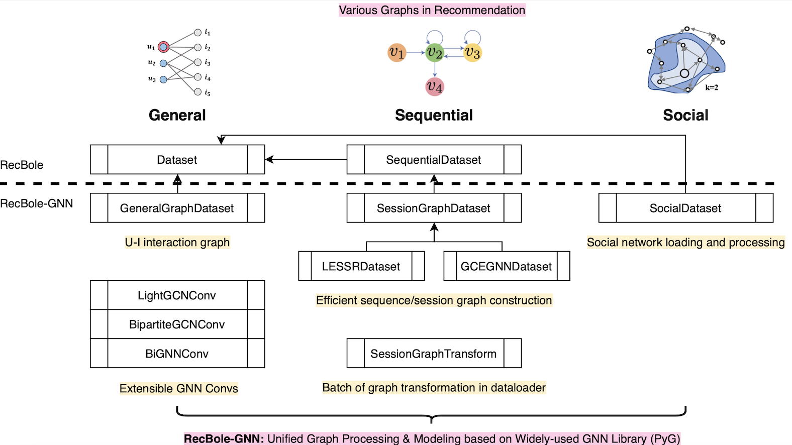

# RecBole-GNN

**RecBole-GNN** is a library built upon [PyTorch](https://pytorch.org) and [RecBole](https://github.com/RUCAIBox/RecBole) for reproducing and developing recommendation algorithms based on graph neural networks (GNNs). Our library includes algorithms covering three major categories:
* **General Recommendation** with user-item interaction graphs;
* **Sequential Recommendation** with session/sequence graphs;
* **Social Recommendation** with social networks.



## Highlights

* **Easy-to-use and unified API**:
    Our library shares unified API and input (atomic files) as RecBole.
* **Efficient and reusable graph processing**:
    We provide highly efficient and reusable basic datasets, dataloaders and layers for graph processing and learning.
* **Extensive graph library**:
    Graph neural networks from widely-used library like [PyG](https://github.com/pyg-team/pytorch_geometric) are incorporated. Recently proposed graph algorithms can be easily equipped and compared with existing methods.

## Quick-Start

With the source code, you can use the provided script for initial usage of our library:

```bash
python run_recbole_gnn.py
```

If you want to change the models or datasets, just run the script by setting additional command parameters:

```bash
python run_recbole_gnn.py -m [model] -d [dataset]
```

## Implemented Models

We list currently supported models according to category:

**General Recommendation**:

* **[NGCF](recbole_gnn/model/general_recommender/ngcf.py)** from Wang *et al.*: [Neural Graph Collaborative Filtering](https://arxiv.org/abs/1905.08108) (SIGIR 2019).
* **[LightGCN](recbole_gnn/model/general_recommender/lightgcn.py)** from He *et al.*: [LightGCN: Simplifying and Powering Graph Convolution Network for Recommendation](https://arxiv.org/abs/2002.02126) (SIGIR 2020).
* **[SGL](recbole_gnn/model/general_recommender/sgl.py)** from Wu *et al.*: [Self-supervised Graph Learning for Recommendation](https://arxiv.org/abs/2010.10783) (SIGIR 2021).
* **[HMLET](recbole_gnn/model/general_recommender/hmlet.py)** from Kong *et al.*: [Linear, or Non-Linear, That is the Question!](https://arxiv.org/abs/2111.07265) (WSDM 2022).
* **[NCL](recbole_gnn/model/general_recommender/ncl.py)** from Lin *et al.*: [Improving Graph Collaborative Filtering with Neighborhood-enriched Contrastive Learning](https://arxiv.org/abs/2202.06200) (TheWebConf 2022).

**Sequential Recommendation**:

* **[SR-GNN](recbole_gnn/model/sequential_recommender/srgnn.py)** from Wu *et al.*: [Session-based Recommendation with Graph Neural Networks](https://arxiv.org/abs/1811.00855) (AAAI 2019).
* **[GC-SAN](recbole_gnn/model/sequential_recommender/gcsan.py)** from Xu *et al.*: [Graph Contextualized Self-Attention Network for Session-based Recommendation](https://www.ijcai.org/proceedings/2019/547) (IJCAI 2019).
* **[NISER+](recbole_gnn/model/sequential_recommender/niser.py)** from Gupta *et al.*: [NISER: Normalized Item and Session Representations to Handle Popularity Bias](https://arxiv.org/abs/1909.04276) (GRLA, CIKM 2019 workshop).
* **[LESSR](recbole_gnn/model/sequential_recommender/lessr.py)** from Chen *et al.*: [Handling Information Loss of Graph Neural Networks for Session-based Recommendation](https://dl.acm.org/doi/10.1145/3394486.3403170) (KDD 2020).
* **[TAGNN](recbole_gnn/model/sequential_recommender/tagnn.py)** from Yu *et al.*: [TAGNN: Target Attentive Graph Neural Networks for Session-based Recommendation](https://arxiv.org/abs/2005.02844) (SIGIR 2020 short).
* **[GCE-GNN](recbole_gnn/model/sequential_recommender/gcegnn.py)** from Wang *et al.*: [Global Context Enhanced Graph Neural Networks for Session-based Recommendation](https://arxiv.org/abs/2106.05081) (SIGIR 2020).
* **[SGNN-HN](recbole_gnn/model/sequential_recommender/sgnnhn.py)** from Pan *et al.*: [Star Graph Neural Networks for Session-based Recommendation](https://dl.acm.org/doi/10.1145/3340531.3412014) (CIKM 2020).

**Social Recommendation**:

* **[DiffNet](recbole_gnn/model/social_recommender/diffnet.py)** from Wu *et al.*: [A Neural Influence Diffusion Model for Social Recommendation](https://arxiv.org/abs/1904.10322) (SIGIR 2019).
* **[GraphRec](recbole_gnn/model/social_recommender/graphrec.py)** from Fan *et al.*: [Graph Neural Networks for Social Recommendation](https://doi.org/10.1145/3308558.3313488) (WWW 2019).
* **[MHCN](recbole_gnn/model/social_recommender/mhcn.py)** from Yu *et al.*: [Self-Supervised Multi-Channel Hypergraph Convolutional Network for Social Recommendation](https://doi.org/10.1145/3442381.3449844) (WWW 2021).
* **[SEPT](recbole_gnn/model/social_recommender/sept.py)** from Yu *et al.*: [Socially-Aware Self-Supervised Tri-Training for Recommendation](https://doi.org/10.1145/3447548.3467340) (KDD 2021).

## Result

### Leaderboard

We carefully tune the hyper-parameters of the implemented models of each research field and release the corresponding leaderboards for reference:

- **General** recommendation on [`MovieLens-1M`](results/general/ml-1m.md) dataset; 
- **Sequential** recommendation on [`Diginetica`](results/sequential/diginetica.md) dataset; 
- **Social** recommendation on [`LastFM`](results/social/lastfm.md) dataset; 

### Efficiency

With the sequential/session graphs preprocessing technique, as well as efficient GNN layers, we speed up the training process of our sequential recommenders a lot.


## The Team

RecBole-GNN is developed and maintained by members from [RUCAIBox](http://aibox.ruc.edu.cn/), the main developers are Yupeng Hou ([@hyp1231](https://github.com/hyp1231)), Lanling Xu ([@Sherry-XLL](https://github.com/Sherry-XLL)) and Changxin Tian ([@ChangxinTian](https://github.com/ChangxinTian)).

## Acknowledgement

The implementation is based on the open-source recommendation library [RecBole](https://github.com/RUCAIBox/RecBole).

Please cite the following paper as the reference if you use our code or processed datasets.

```
@inproceedings{zhao2021recbole,
  title={Recbole: Towards a unified, comprehensive and efficient framework for recommendation algorithms},
  author={Wayne Xin Zhao and Shanlei Mu and Yupeng Hou and Zihan Lin and Kaiyuan Li and Yushuo Chen and Yujie Lu and Hui Wang and Changxin Tian and Xingyu Pan and Yingqian Min and Zhichao Feng and Xinyan Fan and Xu Chen and Pengfei Wang and Wendi Ji and Yaliang Li and Xiaoling Wang and Ji-Rong Wen},
  booktitle={{CIKM}},
  year={2021}
}
